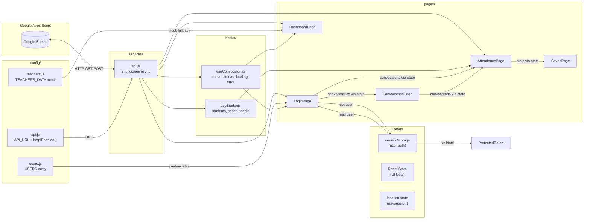
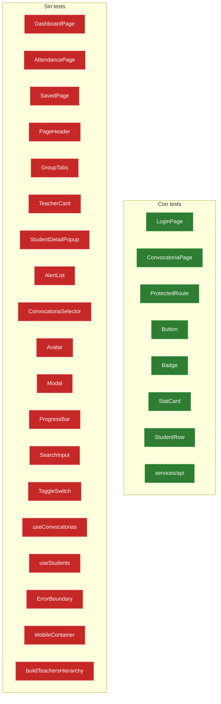

# Grafo de Dependencias — NovAttend

**Fecha:** 2026-03-30
**Modo:** /generate_knowledge_graph (Modo 2)
**Alcance:** Proyecto completo (`src/`)

---

## 1. Grafo General de Dependencias (Mermaid)

```mermaid
graph TD
    %% ===== ENTRY POINT =====
    main[main.jsx] --> ErrorBoundary
    main --> App
    main --> index.css
    main --> animations.css

    %% ===== ROUTING =====
    App[App.jsx] --> MobileContainer
    App --> ProtectedRoute
    App --> LoginPage
    App --> ConvocatoriaPage
    App --> AttendancePage
    App --> SavedPage
    App --> DashboardPage

    %% ===== PAGES -> FEATURES =====
    AttendancePage --> PageHeader
    AttendancePage --> GroupTabs
    AttendancePage --> StudentRow
    DashboardPage --> PageHeader
    DashboardPage --> TeacherCard
    DashboardPage --> StudentDetailPopup
    DashboardPage --> AlertList
    DashboardPage --> ConvocatoriaSelector

    %% ===== PAGES -> UI =====
    LoginPage --> Button
    AttendancePage --> StatCard
    AttendancePage --> ProgressBar
    AttendancePage --> Badge
    AttendancePage --> Button
    ConvocatoriaPage --> Badge
    DashboardPage --> StatCard
    DashboardPage --> Badge
    DashboardPage --> SearchInput
    SavedPage --> StatCard
    SavedPage --> Button

    %% ===== PAGES -> HOOKS =====
    AttendancePage --> useStudents
    DashboardPage --> useConvocatorias

    %% ===== PAGES -> SERVICES/CONFIG =====
    LoginPage --> api_svc[services/api]
    LoginPage --> users_cfg[config/users]
    LoginPage --> api_cfg[config/api]
    AttendancePage --> api_svc
    AttendancePage --> api_cfg
    DashboardPage --> api_svc
    DashboardPage --> api_cfg
    DashboardPage --> teachers_cfg[config/teachers]
    DashboardPage --> buildTeachersHierarchy

    %% ===== FEATURES -> UI =====
    StudentRow --> Avatar
    StudentRow --> ToggleSwitch
    TeacherCard --> Avatar
    TeacherCard --> Badge
    AlertList --> Modal
    StudentDetailPopup --> Modal
    StudentDetailPopup --> Avatar
    StudentDetailPopup --> ProgressBar

    %% ===== FEATURES -> SERVICES/CONFIG =====
    StudentDetailPopup --> api_svc
    StudentDetailPopup --> api_cfg
    TeacherCard --> teachers_cfg

    %% ===== HOOKS -> SERVICES/CONFIG =====
    useConvocatorias --> api_svc
    useConvocatorias --> api_cfg
    useStudents --> api_svc
    useStudents --> api_cfg

    %% ===== SERVICES -> CONFIG =====
    api_svc --> api_cfg

    %% ===== STYLING =====
    classDef page fill:#4A1942,stroke:#C5A059,color:#fff
    classDef feature fill:#2D4059,stroke:#C5A059,color:#fff
    classDef ui fill:#1B3A4B,stroke:#7EC8E3,color:#fff
    classDef hook fill:#3C1361,stroke:#A78BFA,color:#fff
    classDef service fill:#1E3A2F,stroke:#6EE7B7,color:#fff
    classDef config fill:#3B2F2F,stroke:#D4A574,color:#fff
    classDef core fill:#4A4A4A,stroke:#9CA3AF,color:#fff
    classDef util fill:#2F2F3B,stroke:#818CF8,color:#fff

    class LoginPage,ConvocatoriaPage,AttendancePage,SavedPage,DashboardPage page
    class PageHeader,GroupTabs,StudentRow,TeacherCard,StudentDetailPopup,AlertList,ConvocatoriaSelector feature
    class Avatar,Badge,Button,Modal,ProgressBar,SearchInput,StatCard,ToggleSwitch ui
    class useConvocatorias,useStudents hook
    class api_svc service
    class api_cfg,users_cfg,teachers_cfg config
    class App,main,MobileContainer,ProtectedRoute,ErrorBoundary core
    class buildTeachersHierarchy util
```



---

## 2. Flujo de Datos



---

## 3. Tabla de Dependencias por Archivo

### 3.1 Paginas (consumidores principales)

| Pagina | Imports UI | Imports Features | Imports Hooks | Imports Services | Imports Config | Total deps |
|--------|-----------|-----------------|---------------|-----------------|---------------|------------|
| DashboardPage | StatCard, Badge, SearchInput | PageHeader, TeacherCard, StudentDetailPopup, AlertList, ConvocatoriaSelector | useConvocatorias | getProfesores, getResumen | api, teachers | **14** |
| AttendancePage | StatCard, ProgressBar, Badge, Button | PageHeader, GroupTabs, StudentRow | useStudents | guardarAsistencia | api | **10** |
| LoginPage | Button | — | — | getConvocatorias | api, users | **4** |
| SavedPage | StatCard, Button | — | — | — | — | **2** |
| ConvocatoriaPage | Badge | — | — | — | — | **1** |

### 3.2 Features (capa intermedia)

| Feature | Imports UI | Imports Services | Imports Config | Total deps |
|---------|-----------|-----------------|---------------|------------|
| StudentDetailPopup | Modal, Avatar, ProgressBar | getAsistenciaAlumno | api | **5** |
| TeacherCard | Avatar, Badge | — | teachers | **3** |
| StudentRow | Avatar, ToggleSwitch | — | — | **2** |
| AlertList | Modal | — | — | **1** |
| PageHeader | — | — | — | **0** |
| GroupTabs | — | — | — | **0** |
| ConvocatoriaSelector | — | — | — | **0** |

### 3.3 UI (hoja — sin dependencias internas)

| Componente UI | Dependencias | Usado por |
|--------------|-------------|-----------|
| Avatar | 0 | StudentRow, TeacherCard, StudentDetailPopup, DashboardPage |
| Badge | 0 | TeacherCard, AttendancePage, ConvocatoriaPage, DashboardPage |
| Button | 0 | LoginPage, AttendancePage, SavedPage |
| Modal | 0 | AlertList, StudentDetailPopup |
| ProgressBar | 0 | AttendancePage, StudentDetailPopup |
| SearchInput | 0 | DashboardPage |
| StatCard | 0 | AttendancePage, DashboardPage, SavedPage |
| ToggleSwitch | 0 | StudentRow |

### 3.4 Hooks

| Hook | Dependencias | Usado por |
|------|-------------|-----------|
| useConvocatorias | api_cfg, services/api | DashboardPage, LoginPage (directo sin hook) |
| useStudents | api_cfg, services/api | AttendancePage |

### 3.5 Services y Config

| Modulo | Dependencias | Usado por |
|--------|-------------|-----------|
| services/api | config/api | 5 consumidores (Login, Attend, Dash, StudentDetailPopup, hooks x2) |
| config/api | import.meta.env | services/api, hooks x2, pages x3, StudentDetailPopup |
| config/users | ninguna | LoginPage |
| config/teachers | ninguna | DashboardPage, TeacherCard |
| utils/buildTeachersHierarchy | ninguna | DashboardPage |

---

## 4. Analisis de Acoplamiento

### 4.1 Modulos mas acoplados (fan-in = cuantos dependen de el)

| Modulo | Fan-in | Evaluacion |
|--------|--------|------------|
| `config/api` (isApiEnabled) | **7** | ALTO — Punto central de decision API vs mock. Aceptable por diseno |
| `services/api` | **7** | ALTO — Punto unico de acceso a backend. Correcto (single responsibility) |
| `Avatar` | **4** | NORMAL — Componente atomico muy reutilizado |
| `Badge` | **4** | NORMAL |
| `StatCard` | **3** | NORMAL |
| `Button` | **3** | NORMAL |
| `Modal` | **2** | NORMAL |
| `PageHeader` | **2** | NORMAL |

### 4.2 Modulos mas dependientes (fan-out = de cuantos depende)

| Modulo | Fan-out | Evaluacion |
|--------|---------|------------|
| `DashboardPage` | **14** | **EXCESIVO** — Orquesta demasiados componentes directamente |
| `AttendancePage` | **10** | ALTO — Aceptable para pagina principal de flujo |
| `StudentDetailPopup` | **5** | NORMAL para feature con API |
| `LoginPage` | **4** | NORMAL |
| `TeacherCard` | **3** | NORMAL |

### 4.3 Dependencias circulares

```
RESULTADO: 0 dependencias circulares detectadas
```

El grafo es un **DAG limpio** (Directed Acyclic Graph). La jerarquia respeta:
```
config/ -> services/ -> hooks/ -> pages/
                                    |
                         features/ -> ui/
```

---

## 5. Arquitectura de Capas

```
┌─────────────────────────────────────────────────┐
│  CAPA 5: Entry Point                            │
│  main.jsx -> App.jsx (router)                   │
├─────────────────────────────────────────────────┤
│  CAPA 4: Paginas (orquestadoras)                │
│  LoginPage | ConvocatoriaPage | AttendancePage  │
│  SavedPage | DashboardPage                      │
├─────────────────────────────────────────────────┤
│  CAPA 3: Features (logica de negocio visual)    │
│  PageHeader | GroupTabs | StudentRow             │
│  TeacherCard | StudentDetailPopup | AlertList   │
│  ConvocatoriaSelector                           │
├─────────────────────────────────────────────────┤
│  CAPA 2: UI (atomicos puros)                    │
│  Avatar | Badge | Button | Modal                │
│  ProgressBar | SearchInput | StatCard           │
│  ToggleSwitch                                   │
├─────────────────────────────────────────────────┤
│  CAPA 1: Logica (datos y estado)                │
│  hooks/ | services/api | utils/                 │
├─────────────────────────────────────────────────┤
│  CAPA 0: Configuracion                          │
│  config/api | config/users | config/teachers    │
└─────────────────────────────────────────────────┘
```

**Violaciones de capa detectadas:**
- `StudentDetailPopup` (Capa 3) accede directamente a `services/api` (Capa 1) — deberia usar un hook
- `TeacherCard` (Capa 3) accede directamente a `config/teachers` (Capa 0) — deberia recibir datos via props
- `LoginPage` (Capa 4) llama `getConvocatorias()` directamente sin usar `useConvocatorias` hook

---

## 6. Cobertura de Tests vs Dependencias



| Estado | Archivos | Porcentaje |
|--------|----------|------------|
| Con tests | 8 | 30% |
| Sin tests | 19 | 70% |

**Riesgo alto sin tests:** DashboardPage (14 deps), AttendancePage (10 deps), useStudents, useConvocatorias

---

## 7. Inventario Completo de Archivos

| Archivo | Lineas | Capa | Fan-in | Fan-out |
|---------|--------|------|--------|---------|
| main.jsx | 15 | Entry | 0 | 4 |
| App.jsx | 36 | Entry | 1 | 7 |
| LoginPage.jsx | 145 | Page | 1 | 4 |
| ConvocatoriaPage.jsx | 73 | Page | 1 | 1 |
| AttendancePage.jsx | 171 | Page | 1 | 10 |
| SavedPage.jsx | 66 | Page | 1 | 2 |
| DashboardPage.jsx | 273 | Page | 1 | 14 |
| PageHeader.jsx | 68 | Feature | 2 | 0 |
| GroupTabs.jsx | 30 | Feature | 1 | 0 |
| StudentRow.jsx | 60 | Feature | 1 | 2 |
| TeacherCard.jsx | 144 | Feature | 1 | 3 |
| StudentDetailPopup.jsx | 153 | Feature | 1 | 5 |
| AlertList.jsx | 44 | Feature | 1 | 1 |
| ConvocatoriaSelector.jsx | 38 | Feature | 1 | 0 |
| Avatar.jsx | 44 | UI | 4 | 0 |
| Badge.jsx | 30 | UI | 4 | 0 |
| Button.jsx | 72 | UI | 3 | 0 |
| Modal.jsx | 34 | UI | 2 | 0 |
| ProgressBar.jsx | 41 | UI | 2 | 0 |
| SearchInput.jsx | 52 | UI | 1 | 0 |
| StatCard.jsx | 61 | UI | 3 | 0 |
| ToggleSwitch.jsx | 37 | UI | 1 | 0 |
| useConvocatorias.js | 69 | Hook | 2 | 2 |
| useStudents.js | 157 | Hook | 1 | 2 |
| services/api.js | 161 | Service | 7 | 1 |
| config/api.js | 8 | Config | 7 | 0 |
| config/users.js | 11 | Config | 1 | 0 |
| config/teachers.js | 145 | Config | 2 | 0 |
| utils/buildTeachersHierarchy.js | 32 | Util | 1 | 0 |
| ErrorBoundary.jsx | 54 | Core | 1 | 0 |
| MobileContainer.jsx | 37 | Core | 1 | 0 |
| ProtectedRoute.jsx | 18 | Core | 1 | 1 |

**Total:** 31 archivos fuente | 2,598 lineas de codigo

---

## 8. Hallazgos Clave

### Positivo
- **DAG limpio** sin ciclos — arquitectura sana
- **UI Components** son hojas puras (0 dependencias) — altamente reutilizables
- **services/api** es punto unico de acceso al backend — correcto
- **Separacion clara** entre capas config -> service -> hook -> page

### Problemas detectados

| Problema | Severidad | Detalle |
|----------|-----------|---------|
| DashboardPage acoplamiento excesivo | ALTO | 14 dependencias directas — deberia delegar a subcomponentes |
| 3 violaciones de capa | MEDIO | Features acceden a services/config directamente |
| LoginPage no usa useConvocatorias | MEDIO | Duplica logica que ya existe en el hook |
| 70% sin tests | ALTO | 19 de 27 modulos sin cobertura |
| config/teachers como fallback global | MEDIO | Mock data acoplado a DashboardPage y TeacherCard |
